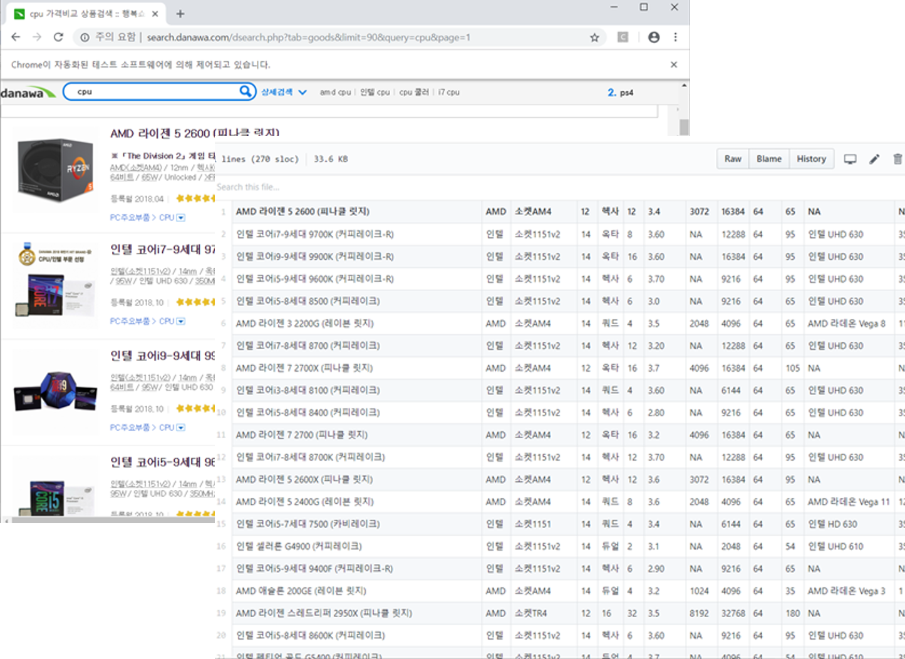

# crawler-selenium
`머신러닝을 이용한 컴퓨터 부품 추천시스템` 에 필요한 데이터 수집을 위한 크롤러 구현

> BeautifulSoup이나 urllib을 이용한 정적 크롤링으로 일반적인 데이터 수집이 가능하나, ajax 데이터 수집을 위해서는   
동적 크롤링이 필요. 그래서 원하는 데이터를 수집하기 위해 Selenium을 이용한 크롤러를 구현.

## Features
* ### 데이터 자동 수집
[다나와](http://danawa.com/)사이트에서 컴퓨터 부품을 검색한 결과 **900개**(*90 items * 10 pages*) 데이터를 자동으로 수집

* ### 병렬 처리
멀티프로세스를 생성하여 총 6개 부품(CPU, HDD, Mainboard, Power, RAM, VGA)에 대한 검색결과 데이터 수집 실행
> 파이썬에는 ``GIL``이 존재하여 멀티스레드와 멀티프로세스 간 속도차이 존재. 따라서 멀티프로세스를 이용   
([[python] GIL(Global Interpreter Lock)](https://118k.tistory.com/606) 참조)

> 멀티스레드 & 멀티프로세스 속도 측정
</img><br/>

* ### CSV 저장

## Installation
```python
pip install selenium
```
## Other Installations
- [Chrome Webdriver](http://chromedriver.chromium.org)
- [Selenium 설치 및 Chrome Webdriver 설치방법](http://blog.naver.com/PostView.nhn?blogId=kiddwannabe&logNo=221259054433&categoryNo=38&parentCategoryNo=0&viewDate=&currentPage=1&postListTopCurrentPage=1&from=search)
## Notice
Chrome의 버전에 맞는 webdriver를 설치해야 함 (74.0.3729.6)
